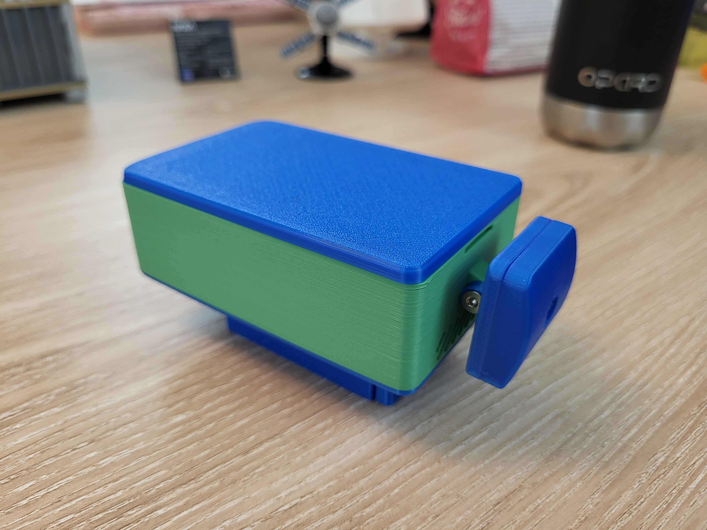
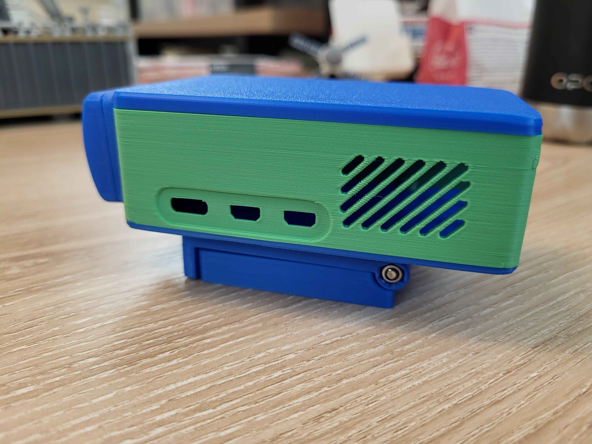
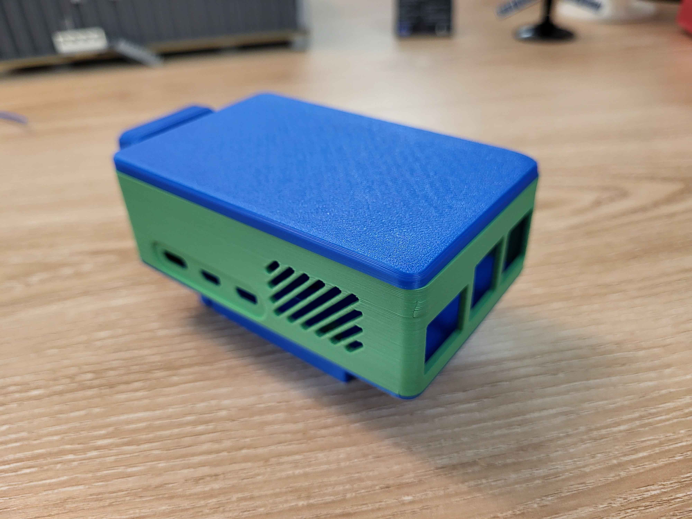

# 🎥 OpenPiCase  

  

**OpenPiCase** is an **open-source, 3D-printable case** designed for the **Raspberry Pi 5** and **Pi Camera Module 3**.  
It features a **sleek, functional design**, **adjustable camera movement**, and can be **mounted on a screen or placed on a desk**.  

---  

## 🖼️ Preview  

    
    
    

  

---  

## 🛠️ Features  

✅ **Compact & modern design** with great airflow  
✅ **Adjustable vertical camera movement** 🎥  
✅ **Screen-mountable or desk-friendly**  
✅ **Easy assembly with magnetic attachments** 🧲  
✅ **Fully open-source & customizable** 🔧  

---  

## 🎨 Parts & Components  

📄 **Complete Parts List:** [Parts List.txt](Parts%20List.txt)  

### 🖨️ **3D Printed Parts**  
- 🏠 **1×** Main Case  
- 🔲 **1×** Lid  
- 🖥️ **1×** Monitor Mount Base  
- 🔩 **1×** Monitor Mount Flap  
- 📷 **1×** Camera Case Back  
- 📸 **1×** Camera Case Front  

### 🔩 **Hardware**  
- **4×** M2.5x10 CSK bolts  
- **4×** M3x8 CSK bolts  
- **4×** M2x6 Cap bolts  
- **1×** M3x16 CSK bolt  
- **1×** M3x35 CSK bolt  
- **1×** M3 Nyloc nut  
- **4×** 6x3mm round magnets  

### ⚡ **Electronics**  
- **1×** Raspberry Pi 5  
- **1×** Raspberry Pi Camera Module 3  
- **1×** Raspberry Pi Active Cooler  
- **1×** Raspberry Pi HAT (AIHailo module - optional)  

---  

## 🔧 Assembly Guide  

1. **Print all parts** using **PLA, PETG, or ABS** (recommended: 0.2mm layer height).  
2. **Assemble the main case** with the Raspberry Pi and active cooler.  
3. **Attach the camera module** into the front/back case and secure it.  
4. **Mount the camera case** to enable vertical movement.  
5. **Fix the monitor mount** (if used) and secure with magnets.  
6. **Enjoy your new Raspberry Pi case!** 🎉  

---  

## 💡 Contributions & Improvements  

💙 **This project is 100% open-source!** If you have ideas for improvements, feel free to:  
- Submit a **Pull Request**  
- Open an **Issue** for discussion  
- Share your **remixes and modifications**!  

---  

## 📜 License  

📝 OpenPiCase is released under the **MIT License** – free to use, modify, and share!  

---  

🎉 **Enjoy & happy printing!** 🚀  
